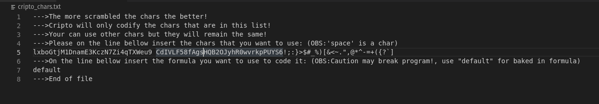

# cripto

This is a little python app I have written when I was studying python and some simple libraries.

This app just codifies a message and decodifies it using a key (not realy secure, just a fun project).

### Some photos:

-main (and only) screen

-config file (very simple and done when I was a beginner)

